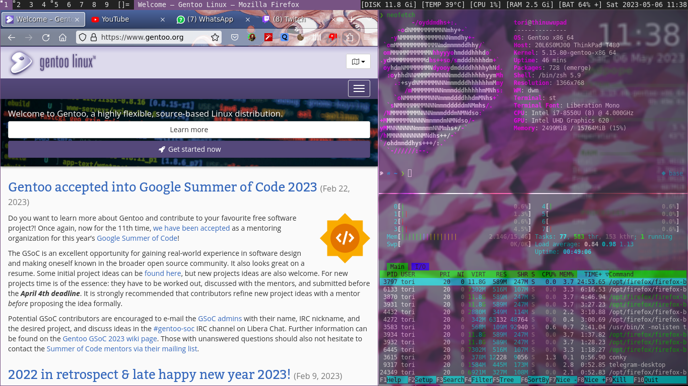

# .t480

## _The Last Best Thinkpad, Ever_

- Dwm
- St
- Smenu
- Slstatus

# Partition Scheme with LVM + LUKS (Inverted Order)

| **Layer**            | **Description**                          | **Example**            |
|----------------------|-------------------------------------------|------------------------|
| Mount Point          | Directory where the LV is mounted         | `/`, `/home`           |
| File System          | Manages files and directories             | `ext4`, `xfs`          |
| Logical Volume (LV)  | Logical volumes created within a VG       | `vg0-root`, `vg0-home` |
| Volume Group (VG)    | A group of physical volumes (PVs)         | `vg0`                  |
| LUKS (Encryption)    | Encryption for physical volumes           | `/dev/sda3 -> luks1`   |
| Physical Volume (PV) | Physical volume used by LVM               | `/dev/mapper/luks1`    |
| Partition (GPT)      | Primary partition on the disk             | `/dev/sda3`            |
| Physical Hard Drive  | Physical storage device containing partitions | `/dev/sda`          |

## Example Configuration

1. **Physical Hard Drive**: `/dev/sda`
2. **Partition (GPT)**: `/dev/sda3`
3. **Physical Volume (PV)**: `/dev/mapper/luks1`  
   - `pvcreate /dev/mapper/luks1`
4. **LUKS Encryption**:
   - `cryptsetup luksFormat /dev/sda3`
   - `cryptsetup open /dev/sda3 luks1`
5. **Volume Group (VG)**: `vg0`  
   - `vgcreate vg0 /dev/mapper/luks1`
6. **Logical Volumes (LVs)**:
   - `lvcreate -L 25G -n root vg0`
   - `lvcreate -L 100G -n home vg0`
7. **File System**:
   - `mkfs.ext4 /dev/vg0/root`
   - `mkfs.ext4 /dev/vg0/home`
8. **Mounting**:
   - `mount /dev/vg0/root /mnt`
   - `mkdir /mnt/home && mount /dev/vg0/home /mnt/home`

**Free Software, Hell Yeah!**

## Commands